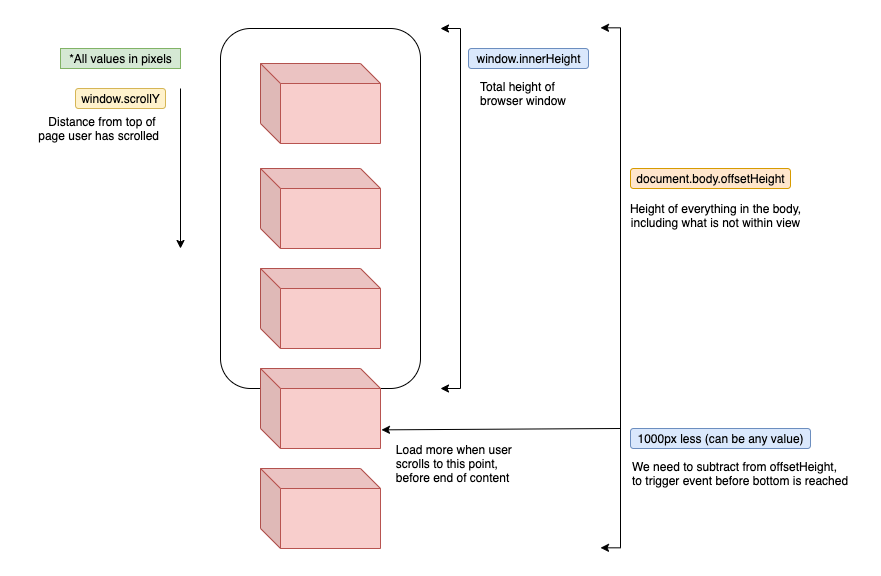

# Infinite Scroll

2nd Project from the course https://www.udemy.com/course/javascript-web-projects-to-build-your-portfolio-resume


Published here: https://makadown.github.io/infinite-scroll/

## Funcionality



## Resources

Loader SVGs, icons, background & more...
```
https://loading.io/
```

Font used for this project
```
https://fonts.google.com/specimen/Ubuntu?preview.text_type=custom&preview.text=Infinite+Scroll&sidebar.open=true&selection.family=Ubuntu:wght@300
```

Royalty free images
```
https://unsplash.com/
https://unsplash.com/documentation#get-a-random-photo
```

W3Schools Foreach, DOM Events
```
https://www.w3schools.com/jsref/jsref_foreach.asp
https://www.w3schools.com/jsref/dom_obj_event.asp
```

Foreach vs For Loops Article
```
https://alligator.io/js/foreach-vs-for-loops/
```